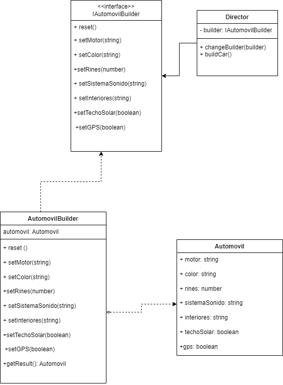

# Ejercicio 1: Personalización de Automóviles

## Patrón de Diseño

- **Categoría:** Creacional
- **Patrón:** Builder (Constructor)

## Descripción del Problema

> Se esta desorrollando una aplicación para una compañía automotriz que permite a los clientes personalizar y ordenar un automóvil. Un objeto Automóvil puede tener muchas configuraciones opcionales: tipo de motor, color, llantas, sistema de sonido, interiores, techo solar, navegación GPS, etc. Crear un objeto Automóvil con múltiples configuraciones puede llevar a constructores con muchos parámetros (el infame "constructor telescópico") o a múltiples constructores sobrecargados, lo que dificulta el mantenimiento y legibilidad del código.
## Justificación

Se escogió el patrón de diseño **Builder** porque:

### 1. **Resuelve el Constructor Telescópico**
   - **Problema:** Con 7+ parámetros opcionales, el constructor tradicional sería poco práctico:
     ```typescript
     // Antipatrón - Constructor telescópico
     new Automovil("V8", "Rojo", 20, "Bose", "Cuero", true, true)
     ```
   - **Solución:** El Builder permite configuración legible y flexible:
     ```typescript
     // Patrón Builder - Mucho más claro
     new AutomovilBuilder()
       .setMotor("V8 Turbo")
       .setColor("Rojo Ferrari")
       .setRines(20)
       .build()
     ```

### 2. **Proporciona Inmutabilidad**
   - Una vez que se construye el automóvil, sus propiedades no pueden cambiar (`readonly`)
   - Garantiza la integridad de los datos del cliente
   - Evita modificaciones inesperadas después de la compra

### 3. **Soporta Configuraciones Opcionales**
   - Cada propiedad es opcional y tiene un valor por defecto sensato
   - El cliente solo configura lo que necesita
   - No requiere múltiples constructores sobrecargados

### 4. **Separación de Responsabilidades**
   - **Builder:** Encapsula cómo se construye el automóvil (pasos)
   - **Director:** Encapsula qué se construye (configuraciones predefinidas)
   - **Automovil:** Solo representa el producto final (datos)

### 5. **Flexibilidad y Escalabilidad**
   - Fácil agregar nuevas características (nuevos `setSomething()`)
   - Fácil agregar nuevos tipos de construcción (nuevos métodos en Director)
   - No requiere modificar código existente

### 6. **Mejora la Experiencia del Usuario**
   - Los clientes pueden construir automóviles paso a paso
   - Hay presets listos (deportivo, económico, lujo)
   - Pueden personalizar tanto como quieran

### 7. **Mantenibilidad a Largo Plazo**
   - Código autoexplicativo y fácil de entender
   - Cambios futuros son simples (agregar más opciones)
   - Reduce deuda técnica comparado con múltiples constructores

## Diagrama de Clases UML




### Componentes:

- **IAutomobilBuilder (Interfaz):** Define el contrato que todo builder debe cumplir
- **AutomovilBuilder (Builder Concreto):** Implementa los pasos de construcción
- **Director:** Encapsula la lógica compleja de construcción con métodos predefinidos
- **Automovil (Producto):** Objeto inmutable final creado por el builder

## Ejecución

### Comando Principal
```bash
npx ts-node ejercicio_1_automovil/index.ts
```

Este comando ejecuta la demostración completa con 3 ejemplos prácticos y visualización detallada.

### Estructura de Archivos
```
ejercicio_1_automovil/
├── Automovil.ts          # Clase producto (objeto inmutable)
├── IAutomobilBuilder.ts  # Interfaz del builder (contrato)
├── AutomovilBuilder.ts   # Builder concreto (implementación)
├── Director.ts           # Director (lógica de construcción) - PUNTO DE ENTRADA
├── index.ts              # Archivo histórico con ejemplos básicos
└── README.md             # Este archivo
```


## Beneficios Demostrados

 **Separación de Responsabilidades** - Director vs Builder vs Producto  
 **Inmutabilidad** - Propiedades readonly en el objeto final  
 **Flexibilidad** - Cambio dinámico de builders  
 **Extensibilidad** - Fácil agregar nuevas configuraciones  
 **Reutilización** - El mismo builder con diferentes directores  
 **Legibilidad** - Código claro y autodescriptivo
